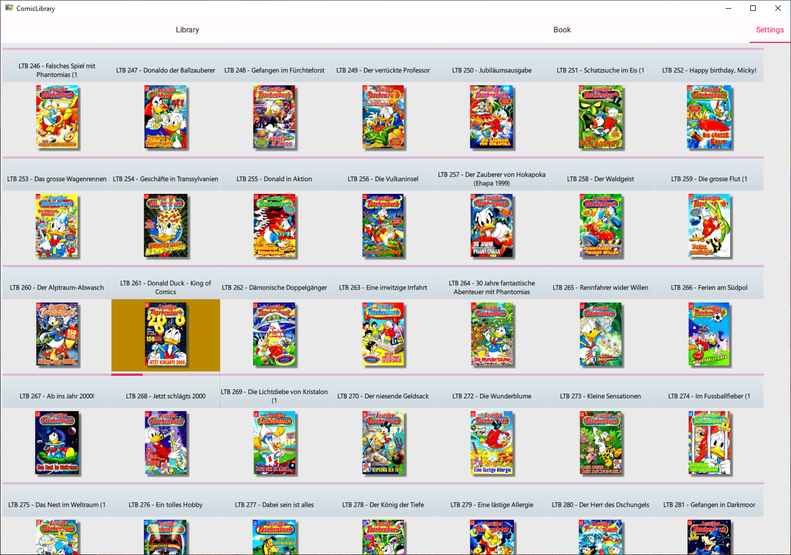

# ComicLibraryQML


ComicLibraryQML is a lightweight program designed for reading comics efficiently, with minimal RAM and storage space requirements. It is built using the QT/QML framework and C++, making it fast and resource-efficient.

## ✅ Cross-Platform Compatibility

This project has been updated and verified to work on both **Windows** and **Linux** platforms:

- **Windows**: Tested with Qt 6.9.1, Visual Studio 2022, and CMake
- **Linux**: Configured for Ubuntu/Debian, Arch Linux, and other distributions
- **Automated deployment** for both platforms
- **Validation scripts** included for easy setup verification


## Preview

[](https://www.youtube.com/watch?v=aYRdpLv9QA0)

## Features

- **Thumbnail Generation:** Automatically generates thumbnails for each comic in your library, enhancing the browsing experience.
- **Bookmarking:** Automatically saves the last opened comic and the page where you left off, allowing you to resume reading from where you stopped.
- **Comic Information Management:** Stores comic metadata, including the number of pages and reading progress, in JSON format for easy retrieval and management.
- **Low Resource Usage:** Designed to consume minimal RAM and storage space, ensuring smooth performance even on low-spec devices.

## Usage

1. **Select Comic Folder:** Choose the folder containing your comic collection within the program.
2. **Thumbnail Generation:** The program will automatically generate thumbnails for comics in the selected folder if they haven't been created yet.
3. **Thumbnail View:** Browse through your comics using the thumbnail view, which displays the contents of the selected folder.
4. **Comic Selection:** Click on a thumbnail to select a comic for reading.
5. **Bookmarking:** The program automatically saves your progress for each comic, allowing you to resume reading from where you left off.

## Requirements

- Qt 6.9.1 or later with the following components:
  - Core
  - Gui
  - Qml
  - Quick
  - Pdf
  - Widgets
- CMake 3.21.1 or later
- C++17 compatible compiler
  - On Windows: Visual Studio 2019 or later
  - On Linux: GCC 9+ or Clang 10+
- Git (for cloning submodules)

## Installation

### Quick Start (All Platforms)

```bash
# Clone the repository
git clone https://github.com/steveway/ComicLibraryQML.git
cd ComicLibraryQML

# Initialize submodules
git submodule update --init --recursive

# Build
mkdir build && cd build
cmake ..
cmake --build .

# Deploy (optional - creates standalone package)
cmake --build . --target deploy
```

### Platform-Specific Instructions

#### Windows

1. **Install Qt:**
   - Download Qt 6.9.1 or later from [qt.io](https://www.qt.io/)
   - Make sure to include the Pdf module
   - Install Qt Maintenance Tool for easy component management

2. **Build with Visual Studio:**
```bash
mkdir build && cd build
cmake .. -G "Visual Studio 17 2022" -A x64
cmake --build . --config Release

# Create deployment package
cmake --build . --target deploy
```

3. **Run the Application:**
   - The executable will be in `build/Release/CLCApp.exe`
   - The deployed version with all dependencies will be in `build/deploy/`

#### Linux (Ubuntu/Debian)

1. **Install Dependencies:**
```bash
# Install Qt6 and development tools
sudo apt update
sudo apt install qt6-base-dev qt6-declarative-dev qt6-quickcontrols2-dev libqt6pdf6-dev qt6-tools-dev cmake build-essential git

# Or install Qt via the official Qt installer or aqt tool
```

2. **Build:**
```bash
mkdir build && cd build
cmake ..
make -j$(nproc)

# Create deployment package
make deploy
```

3. **Run the Application:**
```bash
./CLCApp
```

#### Linux (Arch Linux)

1. **Install Dependencies:**
```bash
sudo pacman -Syu qt6-base qt6-declarative qt6-quickcontrols2 qt6-tools cmake git
# Note: Qt6 Pdf module might need to be installed separately
```

2. **Build:**
```bash
mkdir build && cd build
cmake ..
make -j$(nproc)
```

#### Other Linux Distributions

- Install Qt6 development packages through your package manager
- Ensure Qt6 Pdf module is available
- Use the same build commands as above

### Running the Application

After building, you can run the application:

**Windows:**
```bash
# From build directory
./Release/CLCApp.exe

# Or from deployed directory
./deploy/CLCApp.exe
```

**Linux:**
```bash
# From build directory
./CLCApp

# Or from deployed directory
./deploy/CLCApp
```

### Deployment

The project includes automated deployment:

- **Windows:** Uses `windeployqt` to collect all required DLLs and plugins
- **Linux:** Creates a directory with the executable and symlink

To deploy:
```bash
cmake --build . --target deploy
```

The deployed application will be in the `build/deploy/` directory.

### Validation Scripts

The project includes validation scripts to ensure your environment is properly set up:

**Windows:**
```bash
powershell -ExecutionPolicy Bypass -File .\scripts\validate_crossplatform.ps1
```

**Linux:**
```bash
chmod +x ./scripts/validate_crossplatform.sh
./scripts/validate_crossplatform.sh
```

**Full validation with build test:**
```bash
# Windows
powershell -ExecutionPolicy Bypass -File .\scripts\validate_crossplatform.ps1 --build

# Linux
./scripts/validate_crossplatform.sh --build
```

These scripts will check for:
- Required development tools (CMake, compiler, etc.)
- Qt installation and required modules
- Git submodules initialization
- CMake configuration
- Optional build and deployment testing

## Troubleshooting

### Common Issues

**Qt not found:**
- Make sure Qt 6.9.1 or later is installed
- Ensure the Pdf module is included
- Set `Qt6_DIR` or `QT_PREFIX_PATH` environment variable if Qt is not in default location

**Missing DLLs on Windows:**
- Use the deployment target: `cmake --build . --target deploy`
- Run the application from the `build/deploy/` directory

**Build fails on Linux:**
- Install all required Qt6 development packages
- Ensure Qt6 Pdf module is available (may need separate installation)
- Check that all git submodules are initialized

**Submodule issues:**
```bash
git submodule update --init --recursive
```

### Getting Help

- Check the [GitHub Issues](https://github.com/steveway/ComicLibraryQML/issues) for known problems
- Run the validation script to diagnose environment issues
- Ensure all dependencies are properly installed

## Contributing

Contributions to Comic Library Reader are welcome!

## License

This project is licensed under the GNU General Public License version 2 or later (GPL-2.0+).

## Support

For any questions or issues, please [open an issue](https://github.com/steveway/ComicLibraryQML/issues) on GitHub.

